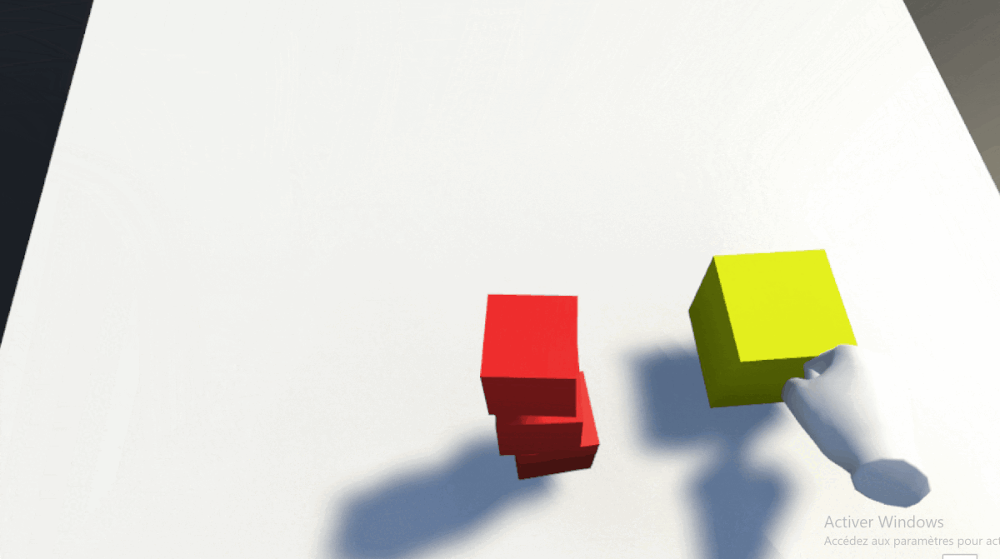

---
slug: FeedBack 2
title: FeedBack 2
authors: [alex, hugo, mathieu, matheo]
tags: [FeedBack, Unity, Interaction objets, Menu, collision]
---

Bonjour à tous,.

Une fois le déplacement via téléportation fait, nous avons mis en place l'interaction entre joueur et un objet quelconque. Pour nos tests, nous avons choisi d'utiliser des cubes, car c'est une forme simple.

Pour tester cette interaction, nous avons crée plusieurs petits cubes avec des physiques différentes. Puis, nous avons testé en plusieurs étapes l'interaction joueur/objet.

Tout d'abord, nous avons testé qu'en fonction de l'action que l'utilisateur fait ( attraper l'objet ou juste traverser celui-ci), la couleur de l'objet change.

Après cela, nous avons fait en sorte de pouvoir attraper un cube dans l'une des mains du joueur.

Pendant ce temps, une autre partie de l'équipe à travailler sur la conception d'un espace de jeu, qui sera plus proche de ce que nous voulons faire. Nous avons donc crée un espace de jeu avec des murs, un sol et un plafond. Nous avons également ajouté deux palliaces et nous avons travaillé sur la physique de la table (collisions).

Nous avons également travaillé sur la création d'un menu, qui permettra de choisir le TP.

Merci de nous avoir lu, à bientôt.

L'équipe LABSTEAM
